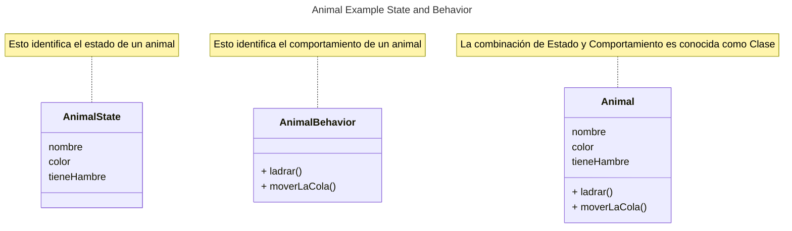

# Programación Orientada a Objetos

Esté README nos introduce a los objetos, clases, herencia, interfaces y paquetes.

## Que es un objeto?

Para entender acerca de la tecnología orientada a objetos. Debemos de mirar a 
nuestro alrededor y encontraremos muchos ejemplos ( Animales, Televisión, etc ).
Los ejemplos de la vida real tiene dos caracteristicas. Todos ellos tienen un 
Estado ( state ) y un Comportamiento ( behavior )



Identificar el estado y comportamiento para los objetos del mundo real es una
excelente forma de iniciar en términos de programación orientada a objetos. 


## Que es una clase?
Una clase es un plano de un objeto que hemos creado.

```java
class Bicycle {

    int cadence = 0;
    int speed = 0;
    int gear = 1;

    void changeCadence(int newValue) {
         cadence = newValue;
    }

    void changeGear(int newValue) {
         gear = newValue;
    }

    void speedUp(int increment) {
         speed = speed + increment;   
    }

    void applyBrakes(int decrement) {
         speed = speed - decrement;
    }

    void printStates() {
         System.out.println("cadence:" +
             cadence + " speed:" + 
             speed + " gear:" + gear);
    }
}
```


## Que es la herencia?
Difererntes objetos normalmente comparten ciertos comportamientos los unos a los 
otros. Claro que cada objeto define sus caracteristicas adicionalmente que lo 
hacen diferentes.


## Biblio
[What Is an Object?](https://docs.oracle.com/javase/tutorial/java/concepts/object.html) <br>
[What Is a Class](https://docs.oracle.com/javase/tutorial/java/concepts/class.html) <br>
[What Is a Inheritance](https://docs.oracle.com/javase/tutorial/java/concepts/inheritance.html)<br>