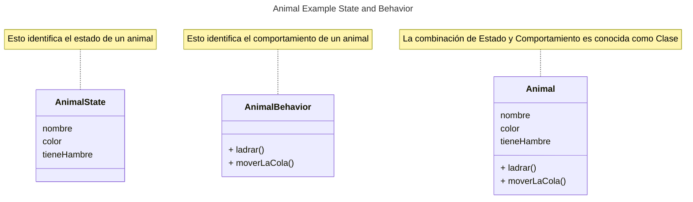

# Programación Orientada a Objetos

Esté README nos introduce a los objetos, clases, herencia, interfaces y paquetes.

## Que es un objeto?

Para entender acerca de la tecnología orientada a objetos. Debemos de mirar a 
nuestro alrededor y encontraremos muchos ejemplos ( Animales, Televisión, etc ).
Los ejemplos de la vida real tiene dos caracteristicas. Todos ellos tienen un 
Estado ( state ) y un Comportamiento ( behavior )

Identificar el estado y comportamiento para los objetos del mundo real es una
excelente forma de iniciar en términos de programación orientada a objetos. 

## Biblio
[What Is an Object?](https://docs.oracle.com/javase/tutorial/java/concepts/object.html)